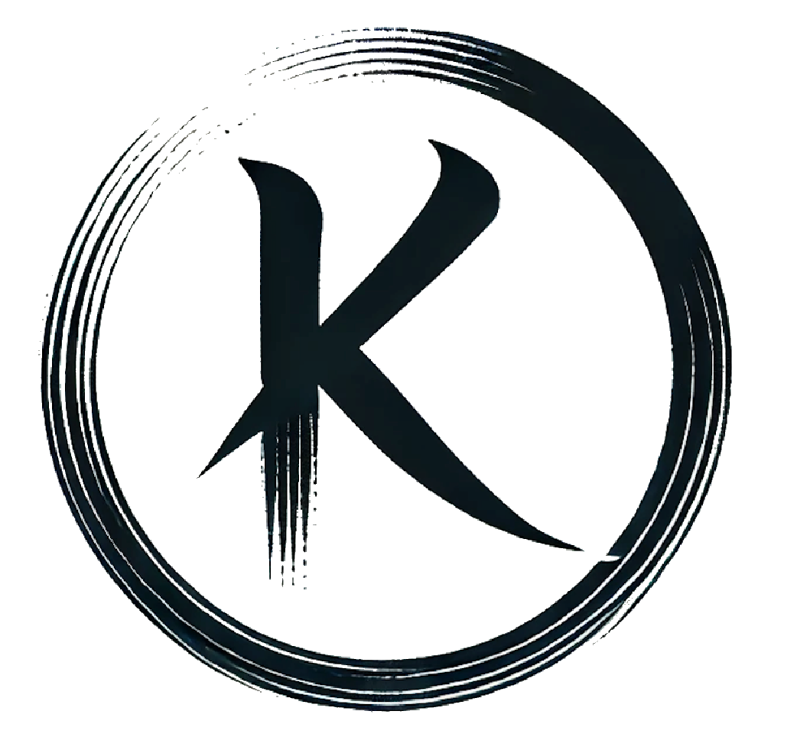

<!-- Improved compatibility of back to top link: See: https://github.com/othneildrew/Best-README-Template/pull/73 -->
<a id="readme-top"></a>
<!--
*** https://github.com/othneildrew/Best-README-Template/blob/main/BLANK_README.md
*** Thanks for checking out the Best-README-Template. If you have a suggestion
*** that would make this better, please fork the repo and create a pull request
*** or simply open an issue with the tag "enhancement".
*** Don't forget to give the project a star!
*** Thanks again! Now go create something AMAZING! :D
-->


<!-- PROJECT SHIELDS -->
<!--
*** I'm using markdown "reference style" links for readability.
*** Reference links are enclosed in brackets [ ] instead of parentheses ( ).
*** See the bottom of this document for the declaration of the reference variables
*** for contributors-url, forks-url, etc. This is an optional, concise syntax you may use.
*** https://www.markdownguide.org/basic-syntax/#reference-style-links
-->
[![Contributors][contributors-shield]][contributors-url]
[![Forks][forks-shield]][forks-url]
[![Stargazers][stars-shield]][stars-url]
[![Issues][issues-shield]][issues-url]
[![MIT License][license-shield]][license-url]
[![LinkedIn][linkedin-shield]][linkedin-url]


<!-- PROJECT LOGO -->
<br />
<div align="center">
  <a href="https://kyotoai.org">
    
  </a>

<h3 align="center">SEIMEI</h3>

  <p align="center">
    Search-Engine-Integrated Multi-Expert Inference (SEIMEI)
  </p>
  <p align="center">
    SEIMEI is an opensource library which allows us to freely add LLM inferences - called "Expert" in this system - specifically designed for your own task and database. The biggest feature of SEIMEI is that users don't need to understand the whole LLM system because each inference is integrated and optimized by search engine automatically. Therefore, many people can improve an AI system by adding their own expertise. Read the below content to see more detail.
    <br />
    <a href="https://github.com/kyotoai/SEIMEI"><strong>Explore the docs »</strong></a>
    <br />
    <br />
    <a href="https://github.com/kyotoai/SEIMEI/tree/main/demo">View Demo</a>
    ·
    <a href="https://github.com/kyotoai/SEIMEI/issues/new?labels=bug&template=bug-report---.md">Report Bug</a>
    ·
    <a href="https://github.com/kyotoai/SEIMEI/issues/new?labels=enhancement&template=feature-request---.md">Request Feature</a>
  </p>
</div>


<!-- TABLE OF CONTENTS -->
<details>
  <summary>Table of Contents</summary>
  <ol>
    <li>
      <a href="#about-the-project">About The Project</a>
      <ul>
        <li><a href="#built-with">Built With</a></li>
      </ul>
    </li>
    <li>
      <a href="#getting-started">Getting Started</a>
      <ul>
        <li><a href="#prerequisites">Prerequisites</a></li>
        <li><a href="#installation">Installation</a></li>
      </ul>
    </li>
    <li><a href="#usage">Usage</a></li>
    <li><a href="#roadmap">Roadmap</a></li>
    <li><a href="#contributing">Contributing</a></li>
    <li><a href="#license">License</a></li>
    <li><a href="#contact">Contact</a></li>
    <li><a href="#acknowledgments">Acknowledgments</a></li>
  </ol>
</details>


<!-- ABOUT THE PROJECT -->
## About The Project

<!-- [![Product Name Screen Shot][product-screenshot]](https://example.com) -->
<div align="center">
  
</div>

Here's the figure to show overall structure of SEIMEI. Each expert interacts with LLM and document and makes inference. These inferences are automatically integrated by search engine and gives an answer of question.

<p align="right">(<a href="#readme-top">back to top</a>)</p>


### Built With

* [![vLLM][vllm.ai]][vllm-url]
* [![Hugging Face][huggingface.co]][huggingface-url]
  
<!--
* [![Next][Next.js]][Next-url]
* [![React][React.js]][React-url]
* [![Vue][Vue.js]][Vue-url]
* [![Angular][Angular.io]][Angular-url]
* [![Svelte][Svelte.dev]][Svelte-url]
* [![Laravel][Laravel.com]][Laravel-url]
* [![Bootstrap][Bootstrap.com]][Bootstrap-url]
* [![JQuery][JQuery.com]][JQuery-url]
-->

<p align="right">(<a href="#readme-top">back to top</a>)</p>


<!-- GETTING STARTED -->
## Getting Started

This is an example of how you build SEIMEI on local gpu or rental server gpu.
You can use it by installing seimei using `pip install` or downloading this directory into your local folder.

### Prerequisites

This is an example of how to list things you need to use the software and how to install them.
* transformers
  ```sh
  pip install transformers
  ```
* sentence_transformers
  ```sh
  pip install sentence_transformers
  ```
* vLLM
  ```sh
  pip install vllm
  pip install ray
  pip install packaging
  pip install typing
  ```

### Installation

* by `pip install`
  
1. Install seimei (not prepared yet)
   ```sh
   pip install seimei
   ```


* by downloading SEIMEI repository
  
1. Download the repo
   ```sh
   git clone https://github.com/kyotoai/SEIMEI.git
   ```

<p align="right">(<a href="#readme-top">back to top</a>)</p>


<!-- USAGE EXAMPLES -->
## Usage

We are still developing this library. Please wait for it completing soon!

<p align="right">(<a href="#readme-top">back to top</a>)</p>


<!-- ROADMAP -->
## Roadmap

- [ ] Feature 1
- [ ] Feature 2
- [ ] Feature 3
    - [ ] Nested Feature

See the [open issues](https://github.com/github_username/repo_name/issues) for a full list of proposed features (and known issues).

<p align="right">(<a href="#readme-top">back to top</a>)</p>


<!-- CONTRIBUTING -->
## Contributing

Contributions are what make the open source community such an amazing place to learn, inspire, and create. Any contributions you make are **greatly appreciated**.

If you have a suggestion that would make this better, please fork the repo and create a pull request. You can also simply open an issue with the tag "enhancement".
Don't forget to give the project a star! Thanks again!

1. Fork the Project
2. Create your Feature Branch (`git checkout -b feature/AmazingFeature`)
3. Commit your Changes (`git commit -m 'Add some AmazingFeature'`)
4. Push to the Branch (`git push origin feature/AmazingFeature`)
5. Open a Pull Request

<p align="right">(<a href="#readme-top">back to top</a>)</p>

### Top contributors:

<!--<a href="https://github.com/github_username/repo_name/graphs/contributors">-->
<a href="https://github.com/kyotoai/SEIMEI/graphs/contributors">
  
</a>


<!-- LICENSE -->
## License

Distributed under the Apache-2.0 License. See `LICENSE.txt` for more information.

<p align="right">(<a href="#readme-top">back to top</a>)</p>


<!-- CONTACT --><!-- [@twitter_handle](https://twitter.com/twitter_handle) -->
## Contact

* Kentaro Seki - seki.kentaro@kyotoai.org
* Ryu Sugauma - suganuma.ryu@kyotoai.org

KyotoAI homepage: [https://kyotoai.org](https://kyotoai.org)

Project Link: [https://github.com/kyotoai/SEIMEI](https://github.com/kyotoai/SEIMEI)

<p align="right">(<a href="#readme-top">back to top</a>)</p>


<!-- ACKNOWLEDGMENTS -->
## Acknowledgments

* [vLLM](https://docs.vllm.ai/en/latest/)
* [Huggingface](https://huggingface.co)
* [Kyoto University Library](https://www.kulib.kyoto-u.ac.jp/mainlib/en/)

<p align="right">(<a href="#readme-top">back to top</a>)</p>


<!-- MARKDOWN LINKS & IMAGES -->
<!-- https://www.markdownguide.org/basic-syntax/#reference-style-links -->
[vllm.ai]: https://img.shields.io/badge/vLLM-blue
[vllm-url]: https://docs.vllm.ai/en/latest/
[huggingface.co]: https://img.shields.io/badge/huggingface-yellow
[huggingface-url]: https://huggingface.co
[contributors-shield]: https://img.shields.io/github/contributors/kyotoai/SEIMEI.svg?style=for-the-badge
[contributors-url]: https://github.com/kyotoai/SEIMEI/graphs/contributors
[license-shield]: https://img.shields.io/github/license/kyotoai/SEIMEI.svg?style=for-the-badge
[license-url]: https://github.com/kyotoai/SEIMEI/LICENSE.txt

[forks-shield]: https://img.shields.io/github/forks/github_username/repo_name.svg?style=for-the-badge
[forks-url]: https://github.com/github_username/repo_name/network/members
[stars-shield]: https://img.shields.io/github/stars/github_username/repo_name.svg?style=for-the-badge
[stars-url]: https://github.com/github_username/repo_name/stargazers
[issues-shield]: https://img.shields.io/github/issues/github_username/repo_name.svg?style=for-the-badge
[issues-url]: https://github.com/github_username/repo_name/issues
[linkedin-shield]: https://img.shields.io/badge/-LinkedIn-black.svg?style=for-the-badge&logo=linkedin&colorB=555
[linkedin-url]: https://linkedin.com/in/linkedin_username
[product-screenshot]: images/screenshot.png

[Next.js]: https://img.shields.io/badge/next.js-000000?style=for-the-badge&logo=nextdotjs&logoColor=white
[Next-url]: https://nextjs.org/
[React.js]: https://img.shields.io/badge/React-20232A?style=for-the-badge&logo=react&logoColor=61DAFB
[React-url]: https://reactjs.org/
[Vue.js]: https://img.shields.io/badge/Vue.js-35495E?style=for-the-badge&logo=vuedotjs&logoColor=4FC08D
[Vue-url]: https://vuejs.org/
[Angular.io]: https://img.shields.io/badge/Angular-DD0031?style=for-the-badge&logo=angular&logoColor=white
[Angular-url]: https://angular.io/
[Svelte.dev]: https://img.shields.io/badge/Svelte-4A4A55?style=for-the-badge&logo=svelte&logoColor=FF3E00
[Svelte-url]: https://svelte.dev/
[Laravel.com]: https://img.shields.io/badge/Laravel-FF2D20?style=for-the-badge&logo=laravel&logoColor=white
[Laravel-url]: https://laravel.com
[Bootstrap.com]: https://img.shields.io/badge/Bootstrap-563D7C?style=for-the-badge&logo=bootstrap&logoColor=white
[Bootstrap-url]: https://getbootstrap.com
[JQuery.com]: https://img.shields.io/badge/jQuery-0769AD?style=for-the-badge&logo=jquery&logoColor=white
[JQuery-url]: https://jquery.com 
