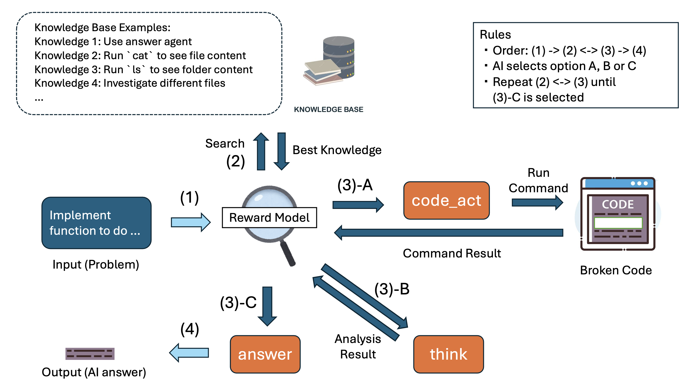
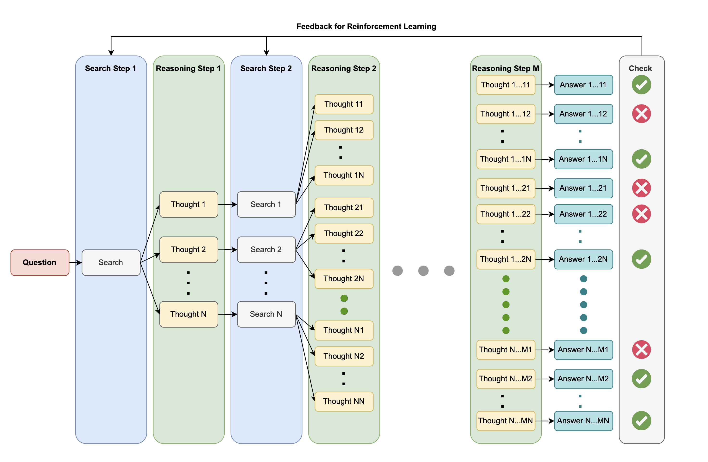

<!-- Improved compatibility of back to top link: See: https://github.com/othneildrew/Best-README-Template/pull/73 -->
<a id="readme-top"></a>
<!--
*** https://github.com/othneildrew/Best-README-Template/blob/main/BLANK_README.md
*** Thanks for checking out the Best-README-Template. If you have a suggestion
*** that would make this better, please fork the repo and create a pull request
*** or simply open an issue with the tag "enhancement".
*** Don't forget to give the project a star!
*** Thanks again! Now go create something AMAZING! :D
-->


<!-- PROJECT SHIELDS -->
<!--
*** I'm using markdown "reference style" links for readability.
*** Reference links are enclosed in brackets [ ] instead of parentheses ( ).
*** See the bottom of this document for the declaration of the reference variables
*** for contributors-url, forks-url, etc. This is an optional, concise syntax you may use.
*** https://www.markdownguide.org/basic-syntax/#reference-style-links
-->
[![Paper][paper-shield]][paper-url]
[![Document][document-shield]][document-url]
[![Contributors][contributors-shield]][contributors-url]
[![Forks][forks-shield]][forks-url]
[![Stargazers][stars-shield]][stars-url]
[![Issues][issues-shield]][issues-url]
[![MIT License][license-shield]][license-url]
[![LinkedIn][linkedin-shield]][linkedin-url]


<!-- PROJECT LOGO -->
<br />
<div align="center">
  <a href="https://kyotoai.org">
    
  </a>

<h3 align="center">SEIMEI</h3>

  <p align="center">
    <strong>S</strong>earch-<strong>E</strong>nhanced <strong>I</strong>nterface for <strong>M</strong>ulti-<strong>E</strong>xpertise <strong>I</strong>ntegration
  </p>
  <p align="center">
    Unlike conventional RL that only optimizes knowledge inside the LLM, SEIMEI jointly optimizes external knowledge, enabling AI to truly absorb domain-specific and tacit expertise. Build much more personalized AI trained only for you with dramatically lower cost and higher adaptability!!
    <br />
    <a href="https://github.com/kyotoai/SEIMEI/tree/main/demo"><strong>Explore the docs »</strong></a>
    <br />
    <br />
    <a href="https://github.com/kyotoai/SEIMEI/tree/main/demo">View Demo</a>
    ·
    <a href="https://github.com/kyotoai/SEIMEI/issues/new?labels=bug&template=bug-report---.md">Report Bug</a>
    ·
    <a href="https://github.com/kyotoai/SEIMEI/issues/new?labels=enhancement&template=feature-request---.md">Request Feature</a>
  </p>
</div>


<!-- TABLE OF CONTENTS -->
<details>
  <summary>Table of Contents</summary>
  <ol>
    <li>
      <a href="#about-the-project">About The Project</a>
      <ul>
        <li><a href="#built-with">Built With</a></li>
      </ul>
    </li>
    <li>
      <a href="#getting-started">Getting Started</a>
      <ul>
        <li><a href="#prerequisites">Prerequisites</a></li>
        <li><a href="#installation">Installation</a></li>
      </ul>
    </li>
    <li><a href="#usage">Usage</a></li>
    <li><a href="#roadmap">Roadmap</a></li>
    <li><a href="#contributing">Contributing</a></li>
    <li><a href="#license">License</a></li>
    <li><a href="#contact">Contact</a></li>
    <li><a href="#acknowledgments">Acknowledgments</a></li>
  </ol>
</details>


<!-- ABOUT THE PROJECT -->
## About The Project

### Search The Best Knowledge For Accurate Thought
<!-- [![Product Name Screen Shot][product-screenshot]](https://example.com) -->
<br />
<div align="center">
  
</div>

<br />
Here's the example of how SEIMEI works. Each agent interacts with LLM and document and makes inference. These inferences are automatically integrated by search engine and gives an answer of question.

<p align="right">(<a href="#readme-top">back to top</a>)</p>

<!--

### The Most Intelligent Search Model
<div align="center">
  
</div>

Reward model performs better than semantic embedding model(so called vector search). The graph above shows the result of training reward model (3b) and e5-mistral-7b model to search best knowledge. While the vector search model cannot really retrieve best knowledge (because problems and knowledge texts are not similar as sentences), our proprietary search model can learn what knowledge are needed to solve a question and retrieve the best ones.

<a href="https://github.com/kyotoai/SEIMEI/tree/main/demo"><strong>See more details »</strong></a>

<p align="right">(<a href="#readme-top">back to top</a>)</p>

### Improves Strong Models

<div align="center">
  
</div>

We acheved an improvement of bigcodebench/deepseek-r1 by our search engine!!

<a href="https://github.com/kyotoai/SEIMEI/tree/main/demo"><strong>See more details »</strong></a>

<p align="right">(<a href="#readme-top">back to top</a>)</p>


### Built With

* [![vLLM][vllm.ai]][vllm-url]
* [![Hugging Face][huggingface.co]][huggingface-url]
* [OpenAI](https://platform.openai.com/docs/overview)
  

* [![Next][Next.js]][Next-url]
* [![React][React.js]][React-url]
* [![Vue][Vue.js]][Vue-url]
* [![Angular][Angular.io]][Angular-url]
* [![Svelte][Svelte.dev]][Svelte-url]
* [![Laravel][Laravel.com]][Laravel-url]
* [![Bootstrap][Bootstrap.com]][Bootstrap-url]
* [![JQuery][JQuery.com]][JQuery-url]


<p align="right">(<a href="#readme-top">back to top</a>)</p>
-->


<!-- Quick Start -->
## Quick Start

### Installation

You can install SEIMEI using git clone the library

```sh
git clone https://github.com/kyotoai/SEIMEI.git
pip install -e SEIMEI/
```

### Set API key

1. Get KyotoAI API key from [https://kyotoai.net](https://kyotoai.net)

2. Run
```bash
export OPENAI_API_KEY = "(your_openai_api_key)"
export KYOTOAI_API_KEY = "(your_kyotoai_api_key)"
```

### Run SEIMEI

#### In CLI app

Open seimei terminal app inside your project directory by

```bash
seimei
```

and start asking question.

#### python code

```python
import asyncio
from seimei import seimei

async def demo_code_act():
    orchestrator = seimei(
        llm_config={"model": "gpt-5-nano"},
        max_tokens_per_question=30000,
    )
    
    result = await orchestrator(
        messages=[
            {"role": "user", "content": "Analyze the current directory and change."},
        ],
        knowledge_load_config=[
            {"load_knowledge_path": "seimei_knowledge/knowledge.csv"},
        ],
    )

asyncio.run(demo_code_act())
```

<p align="right">(<a href="#readme-top">back to top</a>)</p>

---

<!-- USAGE EXAMPLES -->
## Usage A. Integrate your own knowledge

### Overview

1. **Prepare a knowledge file.**  
   Create a CSV with reusable hints for each agent (`think`, `code_act`, `answer`, `web_search`, or `*` for all agents).  
   This becomes your portable memory layer that can be reused across runs.

2. **Run SEIMEI with knowledge loading rules.**  
   Pass `knowledge_load_config` to load CSV/JSON/JSONL files and to inject inline, step-specific hints.  
   This lets you control both *what* knowledge is injected and *when* it is used.

3. **(Optional) Accumulate new knowledge automatically.**  
   Enable `knowledge_generate_config` to append run retrospectives into your CSV after each run.  
   The newly generated rows are returned in the response and immediately reusable.

### 1. Prepare your knowledge file

Create `seimei_knowledge/knowledge.csv` (minimum columns: `agent`, `knowledge`).

```csv
agent,knowledge,tags,step,id
code_act,"Prefer rg before grep when scanning large repos","[\"search\",\"shell\"]",,101
think,"Before choosing next action, summarize the last 2 agent findings in one sentence","[\"planning\"]",">=2",102
answer,"End with a short numbered next-step list when uncertainty remains","[\"response\"]",,103
*,"Always verify file paths before proposing edits","[\"safety\"]",,104
```

- `agent`: target agent name (`*` means all agents).
- `knowledge`: guidance text injected into that agent.
- `tags` (optional): JSON list or comma-separated string.
- `step` (optional): step constraint like `2`, `>=2`, `<4`, or `>=1,<=3`.
- `id` (optional): stable identifier for tracking and updates.

You can also bootstrap entries with the built-in generator:

```bash
python3 -m seimei.knowledge.generate_from_generators \
  --count 25 \
  --output seimei_knowledge/knowledge.csv
```

### 2. Run SEIMEI with knowledge loading

```python
import asyncio
from seimei import seimei

async def main():
    orchestrator = seimei(
        llm_config={"model": "gpt-5-nano"},
        allow_code_exec=True,
        max_tokens_per_question=30000,
    )

    result = await orchestrator(
        messages=[
            {"role": "user", "content": "Inspect this repo and suggest a safe cleanup plan."},
        ],
        knowledge_load_config=[
            {"load_knowledge_path": "seimei_knowledge/knowledge.csv"},
            {
                "step": [1, 2],
                "agent": "code_act",
                "text": "Run read-only commands first (pwd, ls, rg) before any edits.",
                "tags": ["safety", "planning"],
            },
            {
                "step": 3,
                "agent": ["think", "answer"],
                "text": "Explicitly list unresolved uncertainties before finalizing.",
                "tags": ["quality"],
            },
        ],
    )
    print(result["output"])

asyncio.run(main())
```

### 3. Automatic knowledge accumulation (optional)

Provide `knowledge_generate_config` when calling the orchestrator to append run retrospectives into a CSV knowledge base:

```python
result = await orchestrator(
    messages=[{"role": "user", "content": "Find clever ways to speed up our ETL pipeline."}],
    knowledge_generate_config={
        "save_knowledge_path": "seimei_knowledge/knowledge.csv",
        "knowledge_generation_prompt_path": "seimei/knowledge/prompts/generate_from_runs.md",
    },
    knowledge_load_config=[
        {"load_knowledge_path": "seimei_knowledge/knowledge.csv"},
    ],
)
```

The helper `seimei.knowledge.generate_from_runs` analyses the newly created run directory under `seimei_runs/` and appends JSON-normalized rows to the CSV (creating it on first use). The orchestrator reloads the knowledge store so subsequent runs benefit from the fresh guidance. The default retrospection prompt lives at `seimei/knowledge/prompts/generate_from_runs.md`, but you can point `knowledge_generation_prompt_path` at an alternative such as `seimei/knowledge/prompts/excel.md` for domain-specific guidance.

Whenever the generator runs, `seimei.__call__` includes both a `knowledge_result` block (metadata, file paths, usage) and a `generated_knowledge` list that mirrors the rows added to disk:

```python
if result.get("generated_knowledge"):
    for entry in result["generated_knowledge"]:
        print(f"[{entry['agent']}] {entry['knowledge']} (tags={entry.get('tags', [])})")
```

This makes it easy to review new heuristics right in your notebook or CLI before they are reused in later runs.


<p align="right">(<a href="#readme-top">back to top</a>)</p>

---


## Usage B. Train Reward Model To Optimize Knowledge

### Overview

1. **Run inference sampling and scoring.**  
   Use `seimei/train/sampling.py` to execute repeated no-knowledge vs knowledge-enabled trials and save scored runs.  
   This creates the base results file used by downstream conversion and training.

2. **Convert results into training dataset files.**  
   Use `seimei/train/dataset_converter1.py` and `seimei/train/dataset_converter2.py` to transform sampled runs into `dataset_list` train/test JSON files.  
   These files match the input schema expected by reward-model trainers.

3. **Train the reward model.**  
   Launch `seimei.train.adpo_lora_rmtrain` (or `grpo_lora_rmtrain`) on the converted dataset list files.  
   Checkpoints are saved to your output directory and can be deployed behind RMSearch.

4. **Evaluate with the trained reward model.**  
   Re-run sampling using `rm_url` + `klg_sample_mode="rm"` and compare summary metrics against baseline sampling output.  
   This directly measures whether trained retrieval ranking improves final task scores.

### 1. Inferences sampling

`Sampling` is a Python API (not a CLI entrypoint), so run it from a small script:

```python
from pathlib import Path
from seimei.train.sampling import Sampling

runner = Sampling(
    dataset_path=Path("exp11_plasma_gkv_v5/dataset.json"),
    output_path=Path("exp11_plasma_gkv_v5/train_v6_results.json"),
    llm_model_name="/workspace/gpt-oss-20b",
    llm_url="https://your-llm-endpoint/v1",
    rm_url=None,           # baseline retrieval
    klg_sample_mode="llm", # knowledge search mode during sampling
    n_no_klg_trials=3,
    n_klg_trials=7,
)
runner.run()
```

### 2. Data conversion

Convert the sampling output with the train converters:

```bash
python3 seimei/train/dataset_converter1.py \
  --input-path exp11_plasma_gkv_v5/train_v6_results.json \
  --output-path exp11_plasma_gkv_v5/train_v6_results_converted.json \
  --dataset-path exp11_plasma_gkv_v5/dataset.json

python3 seimei/train/dataset_converter2.py \
  --input-path exp11_plasma_gkv_v5/train_v6_results_converted.json \
  --output-path-train exp11_plasma_gkv_v5/train_v6_datasetlist_train.json \
  --output-path-test exp11_plasma_gkv_v5/train_v6_datasetlist_test.json \
  --n-batch-elements 10 \
  --test-ratio 0.1
```

### 3. Train reward model

```bash
accelerate launch --config_file ./accelerate_config.yaml \
  -m seimei.train.adpo_lora_rmtrain \
  --dataset-list-train ./exp11_plasma_gkv_v5/train_v6_datasetlist_train.json \
  --dataset-list-test ./exp11_plasma_gkv_v5/train_v6_datasetlist_test.json \
  --model-name /workspace/qwen4b-reward \
  --output-dir ./exp11_plasma_gkv_v5/model_adpo
```

Optional alternative:

```bash
accelerate launch --config_file ./accelerate_config.yaml \
  -m seimei.train.grpo_lora_rmtrain \
  --dataset-list-train ./exp11_plasma_gkv_v5/train_v6_datasetlist_train.json \
  --dataset-list-test ./exp11_plasma_gkv_v5/train_v6_datasetlist_test.json \
  --model-name /workspace/qwen4b-reward \
  --output-dir ./exp11_plasma_gkv_v5/model_grpo
```

### 4. Evaluate your model

Run sampling again with the trained RMSearch endpoint:

```python
from pathlib import Path
from seimei.train.sampling import Sampling

runner = Sampling(
    dataset_path=Path("exp11_plasma_gkv_v5/dataset_test.json"),
    output_path=Path("exp11_plasma_gkv_v5/train_v6_results_eval_rm.json"),
    llm_model_name="/workspace/gpt-oss-20b",
    llm_url="https://your-llm-endpoint/v1",
    rm_url="http://127.0.0.1:8000/rmsearch",  # your deployed trained RM endpoint
    klg_sample_mode="rm",
)
runner.run()
```

Then compare the `summary` blocks in baseline vs RM-enabled result files (for example `klg_overall_mean`, `overall_mean_score_improvement`, and win/loss/tie fields).


<p align="right">(<a href="#readme-top">back to top</a>)</p>

---

### Usage C. CLI Chat

Prefer to experiment directly from the terminal? Install SEIMEI (`pip install -e .` inside this repo) and run:

```bash
seimei
```

The CLI spins up the same orchestrator configuration shown above (code-act agent, `gpt-5-nano`, code execution enabled) and keeps knowledge loading/saving turned on by default (`seimei_knowledge/excel.csv` with prompt `seimei/knowledge/prompts/excel.md`). Every turn streams the agent logs live, clears them once an answer is ready, and redraws the transcript so you see a clean **you → SEIMEI** exchange.

All defaults (model, agent file, knowledge paths, banners, limits, etc.) sit at the top of `seimei/cli.py`, so you can tweak them without touching the CLI logic. Flags such as `--model`, `--knowledge-file`, or `--no-knowledge` are also available if you prefer overriding values at runtime.


<p align="right">(<a href="#readme-top">back to top</a>)</p>

---

<!-- CONTRIBUTING -->
## Contributing

Contributions are what make the open source community such an amazing place to learn, inspire, and create. Any contributions you make are **greatly appreciated**.

If you have a suggestion that would make this better, please fork the repo and create a pull request. You can also simply open an issue with the tag "enhancement".
Don't forget to give the project a star! Thanks again!

1. Fork the Project
2. Create your Feature Branch (`git checkout -b feature/AmazingFeature`)
3. Commit your Changes (`git commit -m 'Add some AmazingFeature'`)
4. Push to the Branch (`git push origin feature/AmazingFeature`)
5. Open a Pull Request

### Top contributors:

<!--<a href="https://github.com/github_username/repo_name/graphs/contributors">-->
<a href="https://github.com/kyotoai/SEIMEI/graphs/contributors">
  
</a>

<p align="right">(<a href="#readme-top">back to top</a>)</p>


<!-- LICENSE -->
## License

Distributed under the Apache-2.0 License. See `LICENSE.txt` for more information.

<p align="right">(<a href="#readme-top">back to top</a>)</p>


<!-- CONTACT --><!-- [@twitter_handle](https://twitter.com/twitter_handle) -->
## Contact

* KyotoAI Inc. - office@kyotoai.org

* KyotoAI homepage: [https://kyotoai.net](https://kyotoai.net)

* Project Link: [https://github.com/kyotoai/SEIMEI](https://github.com/kyotoai/SEIMEI)

<p align="right">(<a href="#readme-top">back to top</a>)</p>


<!-- ACKNOWLEDGMENTS -->
## Acknowledgments

* [vLLM](https://docs.vllm.ai/en/latest/)
* [Huggingface](https://huggingface.co)
* [Kyoto University Library](https://www.kulib.kyoto-u.ac.jp/mainlib/en/)

<p align="right">(<a href="#readme-top">back to top</a>)</p>


<!-- MARKDOWN LINKS & IMAGES -->
<!-- https://www.markdownguide.org/basic-syntax/#reference-style-links -->
[vllm.ai]: https://img.shields.io/badge/vLLM-blue
[vllm-url]: https://docs.vllm.ai/en/latest/
[huggingface.co]: https://img.shields.io/badge/huggingface-yellow
[huggingface-url]: https://huggingface.co
[paper-shield]: https://img.shields.io/badge/Paper-orange?style=for-the-badge
[paper-url]: https://github.com/kyotoai/SEIMEI/demo/paper1.pdf
[document-shield]: https://img.shields.io/badge/Document-blue?style=for-the-badge
[document-url]: https://www.kyotoai.net/docs/seimei.html
[contributors-shield]: https://img.shields.io/github/contributors/kyotoai/SEIMEI.svg?style=for-the-badge
[contributors-url]: https://github.com/kyotoai/SEIMEI/graphs/contributors
[license-shield]: https://img.shields.io/github/license/kyotoai/SEIMEI.svg?style=for-the-badge
[license-url]: https://github.com/kyotoai/SEIMEI/LICENSE.txt

[forks-shield]: https://img.shields.io/github/forks/kyotoai/SEIMEI.svg?style=for-the-badge
[forks-url]: https://github.com/kyotoai/SEIMEI/network/members
[stars-shield]: https://img.shields.io/github/stars/kyotoai/SEIMEI.svg?style=for-the-badge
[stars-url]: https://github.com/kyotoai/SEIMEI/stargazers
[issues-shield]: https://img.shields.io/github/issues/kyotoai/SEIMEI.svg?style=for-the-badge
[issues-url]: https://github.com/kyotoai/SEIMEI/issues
[linkedin-shield]: https://img.shields.io/badge/-LinkedIn-black.svg?style=for-the-badge&logo=linkedin&colorB=555
[linkedin-url]: https://linkedin.com/in/kentaro-seki-b12000339
[product-screenshot]: images/screenshot.png

[Next.js]: https://img.shields.io/badge/next.js-000000?style=for-the-badge&logo=nextdotjs&logoColor=white
[Next-url]: https://nextjs.org/
[React.js]: https://img.shields.io/badge/React-20232A?style=for-the-badge&logo=react&logoColor=61DAFB
[React-url]: https://reactjs.org/
[Vue.js]: https://img.shields.io/badge/Vue.js-35495E?style=for-the-badge&logo=vuedotjs&logoColor=4FC08D
[Vue-url]: https://vuejs.org/
[Angular.io]: https://img.shields.io/badge/Angular-DD0031?style=for-the-badge&logo=angular&logoColor=white
[Angular-url]: https://angular.io/
[Svelte.dev]: https://img.shields.io/badge/Svelte-4A4A55?style=for-the-badge&logo=svelte&logoColor=FF3E00
[Svelte-url]: https://svelte.dev/
[Laravel.com]: https://img.shields.io/badge/Laravel-FF2D20?style=for-the-badge&logo=laravel&logoColor=white
[Laravel-url]: https://laravel.com
[Bootstrap.com]: https://img.shields.io/badge/Bootstrap-563D7C?style=for-the-badge&logo=bootstrap&logoColor=white
[Bootstrap-url]: https://getbootstrap.com
[JQuery.com]: https://img.shields.io/badge/jQuery-0769AD?style=for-the-badge&logo=jquery&logoColor=white
[JQuery-url]: https://jquery.com 
