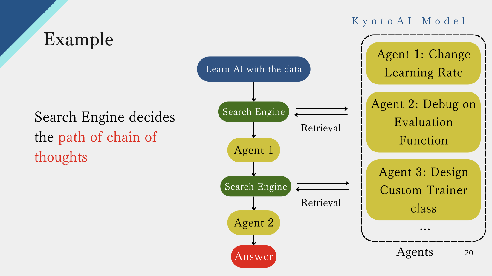

<!-- Improved compatibility of back to top link: See: https://github.com/othneildrew/Best-README-Template/pull/73 -->
<a id="readme-top"></a>
<!--
*** https://github.com/othneildrew/Best-README-Template/blob/main/BLANK_README.md
*** Thanks for checking out the Best-README-Template. If you have a suggestion
*** that would make this better, please fork the repo and create a pull request
*** or simply open an issue with the tag "enhancement".
*** Don't forget to give the project a star!
*** Thanks again! Now go create something AMAZING! :D
-->


<!-- PROJECT SHIELDS -->
<!--
*** I'm using markdown "reference style" links for readability.
*** Reference links are enclosed in brackets [ ] instead of parentheses ( ).
*** See the bottom of this document for the declaration of the reference variables
*** for contributors-url, forks-url, etc. This is an optional, concise syntax you may use.
*** https://www.markdownguide.org/basic-syntax/#reference-style-links
-->
[![Contributors][contributors-shield]][contributors-url]
[![Forks][forks-shield]][forks-url]
[![Stargazers][stars-shield]][stars-url]
[![Issues][issues-shield]][issues-url]
[![MIT License][license-shield]][license-url]
[![LinkedIn][linkedin-shield]][linkedin-url]


<!-- PROJECT LOGO -->
<br />
<div align="center">
  <a href="https://kyotoai.org">
    
  </a>

<h3 align="center">SEIMEI</h3>

  <p align="center">
    Search-Enhanced Interface for Multi-Expertise Integration (SEIMEI)
  </p>
  <p align="center">
    SEIMEI ENABLES 1000s OF AGENTS TO INTERACT WITH EACH OTHER!! With highly intelligent search engine, SEIMEI optimizes reasoning steps (with agents) and achieves SOTA results on tasks requiring deep reasoning!!
    <br />
    <a href="https://github.com/kyotoai/SEIMEI/tree/main/demo"><strong>Explore the docs »</strong></a>
    <br />
    <br />
    <a href="https://github.com/kyotoai/SEIMEI/tree/main/demo">View Demo</a>
    ·
    <a href="https://github.com/kyotoai/SEIMEI/issues/new?labels=bug&template=bug-report---.md">Report Bug</a>
    ·
    <a href="https://github.com/kyotoai/SEIMEI/issues/new?labels=enhancement&template=feature-request---.md">Request Feature</a>
  </p>
</div>


<!-- TABLE OF CONTENTS -->
<details>
  <summary>Table of Contents</summary>
  <ol>
    <li>
      <a href="#about-the-project">About The Project</a>
      <ul>
        <li><a href="#built-with">Built With</a></li>
      </ul>
    </li>
    <li>
      <a href="#getting-started">Getting Started</a>
      <ul>
        <li><a href="#prerequisites">Prerequisites</a></li>
        <li><a href="#installation">Installation</a></li>
      </ul>
    </li>
    <li><a href="#usage">Usage</a></li>
    <li><a href="#roadmap">Roadmap</a></li>
    <li><a href="#contributing">Contributing</a></li>
    <li><a href="#license">License</a></li>
    <li><a href="#contact">Contact</a></li>
    <li><a href="#acknowledgments">Acknowledgments</a></li>
  </ol>
</details>


<!-- ABOUT THE PROJECT -->
## About The Project

### Search The Best Agent To Make Deep Reasoning
<!-- [![Product Name Screen Shot][product-screenshot]](https://example.com) -->
<br />
<div align="center">
  
</div>

<br />
Here's the example of how SEIMEI works. Each agent interacts with LLM and document and makes inference. These inferences are automatically integrated by search engine and gives an answer of question.

<br />
<div align="center">
  
</div>

<br />
By training search engine, we can optimize the thinking steps like o1 or deepseek-r1!!

<p align="right">(<a href="#readme-top">back to top</a>)</p>

### The Most Intelligent Search Engine
<div align="center">
  
</div>

Our proprietary search model performs better than semantic embedding model(so called vector search). The graph above shows the result of training our model (3b) and e5-mistral-7b model to search best agents. While the vector search model cannot really retrieve best agents(because problems and agents do not have similar sentences), our proprietary search model can learn what agents are needed to solve a question and retrieve the best ones!!

<a href="https://github.com/kyotoai/SEIMEI/tree/main/demo"><strong>See more details »</strong></a>

<p align="right">(<a href="#readme-top">back to top</a>)</p>

### Achieves State Of The Art Result

<div align="center">
  
</div>

We acheved an improvement of bigcodebench/deepseek-r1 by our search engine!!

<a href="https://github.com/kyotoai/SEIMEI/tree/main/demo"><strong>See more details »</strong></a>

<p align="right">(<a href="#readme-top">back to top</a>)</p>

### Applications of SEIMEI

<div align="center">
  
</div>

<div align="center">
  
</div>

<div align="center">
  
</div>

SEIMEI can be applied to make these useful functions!!

<a href="https://github.com/kyotoai/SEIMEI/tree/main/demo"><strong>See more details »</strong></a>

<p align="right">(<a href="#readme-top">back to top</a>)</p>

### Built With

* [![vLLM][vllm.ai]][vllm-url]
* [![Hugging Face][huggingface.co]][huggingface-url]
* [OpenAI](https://platform.openai.com/docs/overview)
  
<!--
* [![Next][Next.js]][Next-url]
* [![React][React.js]][React-url]
* [![Vue][Vue.js]][Vue-url]
* [![Angular][Angular.io]][Angular-url]
* [![Svelte][Svelte.dev]][Svelte-url]
* [![Laravel][Laravel.com]][Laravel-url]
* [![Bootstrap][Bootstrap.com]][Bootstrap-url]
* [![JQuery][JQuery.com]][JQuery-url]
-->

<p align="right">(<a href="#readme-top">back to top</a>)</p>


<!-- GETTING STARTED -->
## Getting Started

This is an example of how you build SEIMEI on local gpu or rental server gpu.
You can use it by installing seimei using `pip install` or downloading this directory into your local folder.

### Installation

You can install SEIMEI using git clone the library

```sh
git clone https://github.com/kyotoai/SEIMEI.git
pip install -e SEIMEI/
```

<p align="right">(<a href="#readme-top">back to top</a>)</p>


### Set API key

```bash
export OPENAI_API_KEY = "(your_openai_api_key)"
export KYOTOAI_API_KEY = "(your_kyotoai_api_key)"
```

<p align="right">(<a href="#readme-top">back to top</a>)</p>


<!-- USAGE EXAMPLES -->
## Usage

Here's an usage example using /Experts/Math module. This module answers mathematical questions with brainstorming steps integrated by RMSearch. You can see more examples in /examples/example.ipynb.

### Quick Start

#### In CLI app

```bash
seimei
```

#### python code

```python
import asyncio
from seimei import seimei  # class name is `seimei` (lowercase) for convenience

async def demo_code_act():
    orchestrator = seimei(
        llm_kwargs={"model": "gpt-5-nano"},
        rm_kwargs={"url": "https://kyotoai.net/v1/rmsearch", "agent_routing":False, "knowledge_search":True},
        allow_code_exec=True,
        agent_log_head_lines=1,
        max_tokens_per_question=30000,
    )

    result = await orchestrator(
        messages=[
            {"role": "user", "content": "Design a single 7-day endgame plan for my turbulence surrogate project based on my past history."},
        ],
        load_knowledge_path="seimei_knowledge/knwoledge.csv",
    )

asyncio.run(demo_code_act())
```


### Built-in Agent Demos

SEIMEI ships with two lightweight reference agents under `seimei/agents`. The snippets below show end-to-end runs for each agent with sample questions you can adapt.

#### `code_act`: controlled shell execution

Sample question — *"Run `ls` in the workspace and report the output."*

```python
import asyncio
from seimei import seimei

async def demo_code_act():
    orchestrator = seimei(
        agent_config=[{"file_path": "seimei/agents/code_act.py"}],
        llm_kwargs={"model": "gpt-4o-mini"},
        allow_code_exec=True,
        allowed_commands=["ls", "echo"],
        agent_log_head_lines=1,
        max_tokens_per_question=2000,
    )

    result = await orchestrator(
        messages=[
            {"role": "system", "content": "You are an execution assistant that never runs unasked commands."},
            {"role": "user", "content": "Run ```bash\nls\n``` and summarize the stdout."},
        ]
    )
    # The code_act reply is stored as the last agent message
    print(result["msg_history"][-2]["content"])

asyncio.run(demo_code_act())
```

#### `web_search`: fast fact gathering

Sample question — *"What are three recent applications of perovskite solar cells?"*

> Requires `pip install duckduckgo_search`.

```python
import asyncio
from seimei import seimei

async def demo_web_search():
    orchestrator = seimei(
        agent_config=[{"file_path": "seimei/agents/web_search.py"}],
        llm_kwargs={"model": "gpt-4o-mini"},
        agent_log_head_lines=2,
        max_tokens_per_question=4000,
    )

    result = await orchestrator(
        messages=[
            {"role": "system", "content": "You gather concise search summaries."},
            {"role": "user", "content": "Search the web for recent applications of perovskite solar cells."},
        ]
    )
    print(result["msg_history"][-2]["content"])

asyncio.run(demo_web_search())
```

### CLI Chat

Prefer to experiment directly from the terminal? Install SEIMEI (`pip install -e .` inside this repo) and run:

```bash
seimei
```

The CLI spins up the same orchestrator configuration shown above (code-act agent, `gpt-5-nano`, code execution enabled) and keeps knowledge loading/saving turned on by default (`seimei_knowledge/excel.csv` with prompt `seimei/knowledge/prompts/excel.md`). Every turn streams the agent logs live, clears them once an answer is ready, and redraws the transcript so you see a clean **you → SEIMEI** exchange.

All defaults (model, agent file, knowledge paths, banners, limits, etc.) sit at the top of `seimei/cli.py`, so you can tweak them without touching the CLI logic. Flags such as `--model`, `--knowledge-file`, or `--no-knowledge` are also available if you prefer overriding values at runtime.

### Automatic knowledge accumulation

Set `generate_knowledge=True` when calling the orchestrator to append run retrospectives into a CSV knowledge base:

```python
result = await orchestrator(
    messages=[{"role": "user", "content": "Find clever ways to speed up our ETL pipeline."}],
    generate_knowledge=True,
    save_knowledge_path="seimei_knowledge/knowledge.csv",
    knowledge_prompt_path="seimei/knowledge/prompts/generate_from_runs.md",  # or point at a custom prompt
    load_knowledge_path="seimei_knowledge/knowledge.csv",
)
```

The helper `seimei.knowledge.generate_from_runs` analyses the newly created run directory under `seimei_runs/` and appends JSON-normalized rows to the CSV (creating it on first use). The orchestrator reloads the knowledge store so subsequent runs benefit from the fresh guidance. The default retrospection prompt lives at `seimei/knowledge/prompts/generate_from_runs.md`, but you can point `knowledge_prompt_path` at an alternative such as `seimei/knowledge/prompts/excel.md` for domain-specific guidance.

<p align="right">(<a href="#readme-top">back to top</a>)</p>


<!-- ROADMAP -->
## Roadmap

- [x] Basic Agents
- [x] CLI Chat App Feature
- [x] Knowledge Retrieval
- [ ] Automatical Dataset Generation for RMSearch

See the [open issues](https://github.com/github_username/repo_name/issues) for a full list of proposed features (and known issues).

<p align="right">(<a href="#readme-top">back to top</a>)</p>


<!-- CONTRIBUTING -->
## Contributing

Contributions are what make the open source community such an amazing place to learn, inspire, and create. Any contributions you make are **greatly appreciated**.

If you have a suggestion that would make this better, please fork the repo and create a pull request. You can also simply open an issue with the tag "enhancement".
Don't forget to give the project a star! Thanks again!

1. Fork the Project
2. Create your Feature Branch (`git checkout -b feature/AmazingFeature`)
3. Commit your Changes (`git commit -m 'Add some AmazingFeature'`)
4. Push to the Branch (`git push origin feature/AmazingFeature`)
5. Open a Pull Request

<p align="right">(<a href="#readme-top">back to top</a>)</p>

### Top contributors:

<!--<a href="https://github.com/github_username/repo_name/graphs/contributors">-->
<a href="https://github.com/kyotoai/SEIMEI/graphs/contributors">
  
</a>


<!-- LICENSE -->
## License

Distributed under the Apache-2.0 License. See `LICENSE.txt` for more information.

<p align="right">(<a href="#readme-top">back to top</a>)</p>


<!-- CONTACT --><!-- [@twitter_handle](https://twitter.com/twitter_handle) -->
## Contact

* KyotoAI Inc. - office@kyotoai.org

KyotoAI homepage: [https://kyotoai.net](https://kyotoai.net)

Project Link: [https://github.com/kyotoai/SEIMEI](https://github.com/kyotoai/SEIMEI)

<p align="right">(<a href="#readme-top">back to top</a>)</p>


<!-- ACKNOWLEDGMENTS -->
## Acknowledgments

* [vLLM](https://docs.vllm.ai/en/latest/)
* [Huggingface](https://huggingface.co)
* [Kyoto University Library](https://www.kulib.kyoto-u.ac.jp/mainlib/en/)

<p align="right">(<a href="#readme-top">back to top</a>)</p>


<!-- MARKDOWN LINKS & IMAGES -->
<!-- https://www.markdownguide.org/basic-syntax/#reference-style-links -->
[vllm.ai]: https://img.shields.io/badge/vLLM-blue
[vllm-url]: https://docs.vllm.ai/en/latest/
[huggingface.co]: https://img.shields.io/badge/huggingface-yellow
[huggingface-url]: https://huggingface.co
[contributors-shield]: https://img.shields.io/github/contributors/kyotoai/SEIMEI.svg?style=for-the-badge
[contributors-url]: https://github.com/kyotoai/SEIMEI/graphs/contributors
[license-shield]: https://img.shields.io/github/license/kyotoai/SEIMEI.svg?style=for-the-badge
[license-url]: https://github.com/kyotoai/SEIMEI/LICENSE.txt

[forks-shield]: https://img.shields.io/github/forks/kyotoai/SEIMEI.svg?style=for-the-badge
[forks-url]: https://github.com/kyotoai/SEIMEI/network/members
[stars-shield]: https://img.shields.io/github/stars/kyotoai/SEIMEI.svg?style=for-the-badge
[stars-url]: https://github.com/kyotoai/SEIMEI/stargazers
[issues-shield]: https://img.shields.io/github/issues/kyotoai/SEIMEI.svg?style=for-the-badge
[issues-url]: https://github.com/kyotoai/SEIMEI/issues
[linkedin-shield]: https://img.shields.io/badge/-LinkedIn-black.svg?style=for-the-badge&logo=linkedin&colorB=555
[linkedin-url]: https://linkedin.com/in/kentaro-seki-b12000339
[product-screenshot]: images/screenshot.png

[Next.js]: https://img.shields.io/badge/next.js-000000?style=for-the-badge&logo=nextdotjs&logoColor=white
[Next-url]: https://nextjs.org/
[React.js]: https://img.shields.io/badge/React-20232A?style=for-the-badge&logo=react&logoColor=61DAFB
[React-url]: https://reactjs.org/
[Vue.js]: https://img.shields.io/badge/Vue.js-35495E?style=for-the-badge&logo=vuedotjs&logoColor=4FC08D
[Vue-url]: https://vuejs.org/
[Angular.io]: https://img.shields.io/badge/Angular-DD0031?style=for-the-badge&logo=angular&logoColor=white
[Angular-url]: https://angular.io/
[Svelte.dev]: https://img.shields.io/badge/Svelte-4A4A55?style=for-the-badge&logo=svelte&logoColor=FF3E00
[Svelte-url]: https://svelte.dev/
[Laravel.com]: https://img.shields.io/badge/Laravel-FF2D20?style=for-the-badge&logo=laravel&logoColor=white
[Laravel-url]: https://laravel.com
[Bootstrap.com]: https://img.shields.io/badge/Bootstrap-563D7C?style=for-the-badge&logo=bootstrap&logoColor=white
[Bootstrap-url]: https://getbootstrap.com
[JQuery.com]: https://img.shields.io/badge/jQuery-0769AD?style=for-the-badge&logo=jquery&logoColor=white
[JQuery-url]: https://jquery.com 
